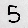

# Machine Learning Introduction

Content based on NeuralNine's [Python Machine Learning Tutorial](https://www.youtube.com/watch?v=jg5paDArl3E&list=PL7yh-TELLS1EZGz1-VDltwdwZvPV-jliQ) YouTube series.

These are my attempts to dig deeper into machine learning base concepts to get more tools that can help me on my Kaggle competitions.

Each notebook file on the main page builds knowledge on different machine learning models from [scikit-learn](https://scikit-learn.org/stable/) (LinearRegression, SupportVector, DecisitonTree, RandomForest, KNeighbors, KMeans) and [TensorFlow](https://www.tensorflow.org/) (neural networks)..

The [digits-neural-model](digits-neural-model) folder has the trained neural network model saved from [neural-networks.ipynb](neural-networks.ipynb) to classify handwritten numerical digits based on the [MNIST database](https://en.wikipedia.org/wiki/MNIST_database). The [digits](digits) folder has handwritten digits like this:

 created by me to be tested with different classification machine learning algorithms in [mnist-models.ipynb](digits-predictions/mnist-models.ipynb), inside [digits-predictions](digits-predictions) folder.